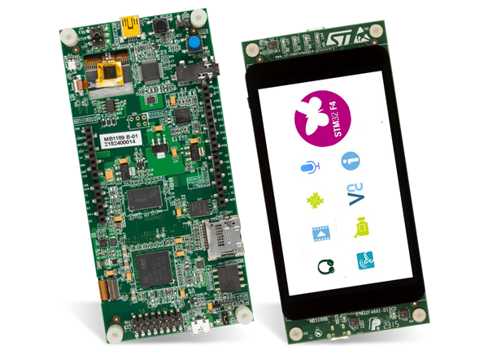
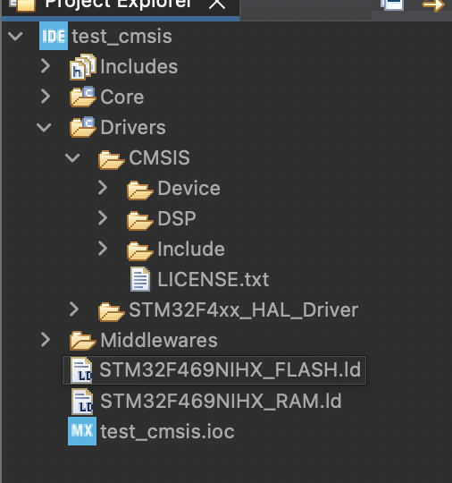
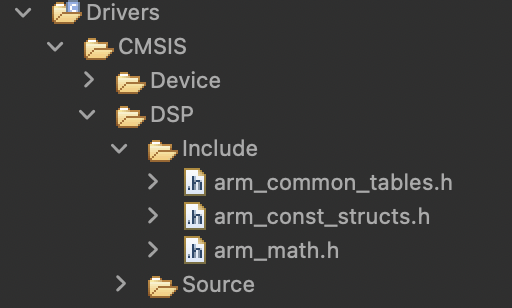
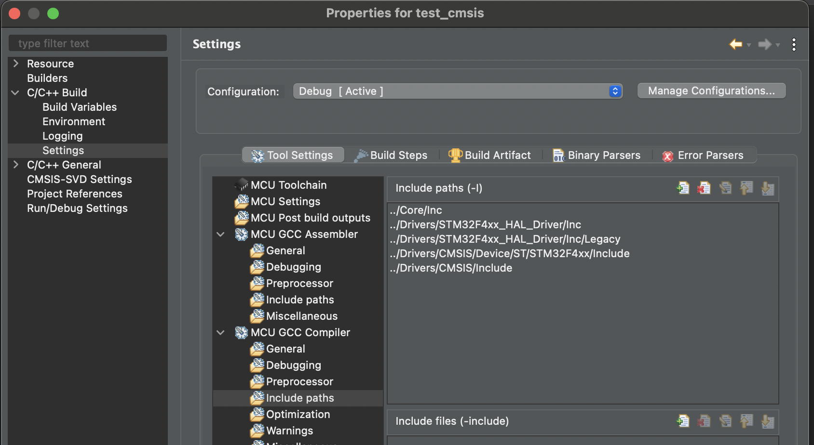
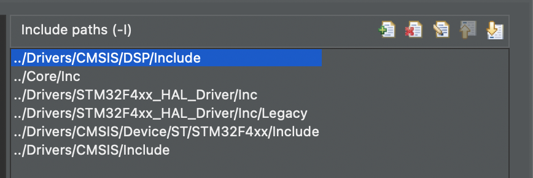
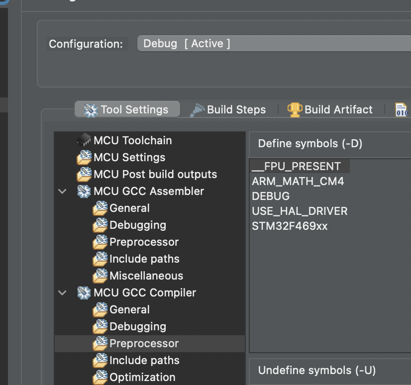

# Agregar CMSIS en proyecto con el STM32CubeIDE
Se va detallar como agregar de manera manual el cmsis a un proyecto con el Stm32CubeIde.<br>
Se lo hace a manera de memoria tecnica.
## Kit usado
El kit usado es STM32F469I-DISCO.<br>

## Ide usado
Se usa STM32CubeIDE y CMSIS directo.
## Repositorio usado
https://github.com/STMicroelectronics/STM32CubeF4

## Incluyendo el CMSIS
- Creamos la carpeta DSP dentro de CMSIS en el proyecto.

- Copiar <STM32Cube_Repository>\STM32Cube_FW_F4_V.X.XX.X\Drivers\CMSIS\DSP\Include y pegarlo en la carpeta DSP recien creada.
- Copiar <STM32Cube_Repository>\STM32Cube_FW_F4_V.X.XX.X\Drivers\CMSIS\DSP\source y pegarlo en la carpeta DSP recien creada.

- La carpeta debe quedar de la siguiente manera.


## Configurando el proyecto y agregar paths
El propósito de esta parte es describir los pasos a seguir para soportar nuevos archivos de cabecera:

- Dar click derecho y seleccionar properties
- En la ventana de properties seleccionar:<br>
C/C++ Build >Settings > Tool Settings > MCU GCC Compiler > Include paths.

- Dar click on “Add” para incluir el nuevo path.
 "../Drivers/CMSIS/DSP/Include"

- En Preprocessor agregar “ARM_MATH_CM4” y "__FPU_PRESENT"


- Luego compilar y agregar las librerias en main.

```c
/* USER CODE END Header */
/* Includes ------------------------------------------------------------------*/
#include "main.h"

/* Private includes ----------------------------------------------------------*/
/* USER CODE BEGIN Includes */
#include "arm_math.h"
#include "arm_const_structs.h"
/* USER CODE END Includes */

/* Private typedef -----------------------------------------------------------*/
/* USER CODE BEGIN PTD */
```
